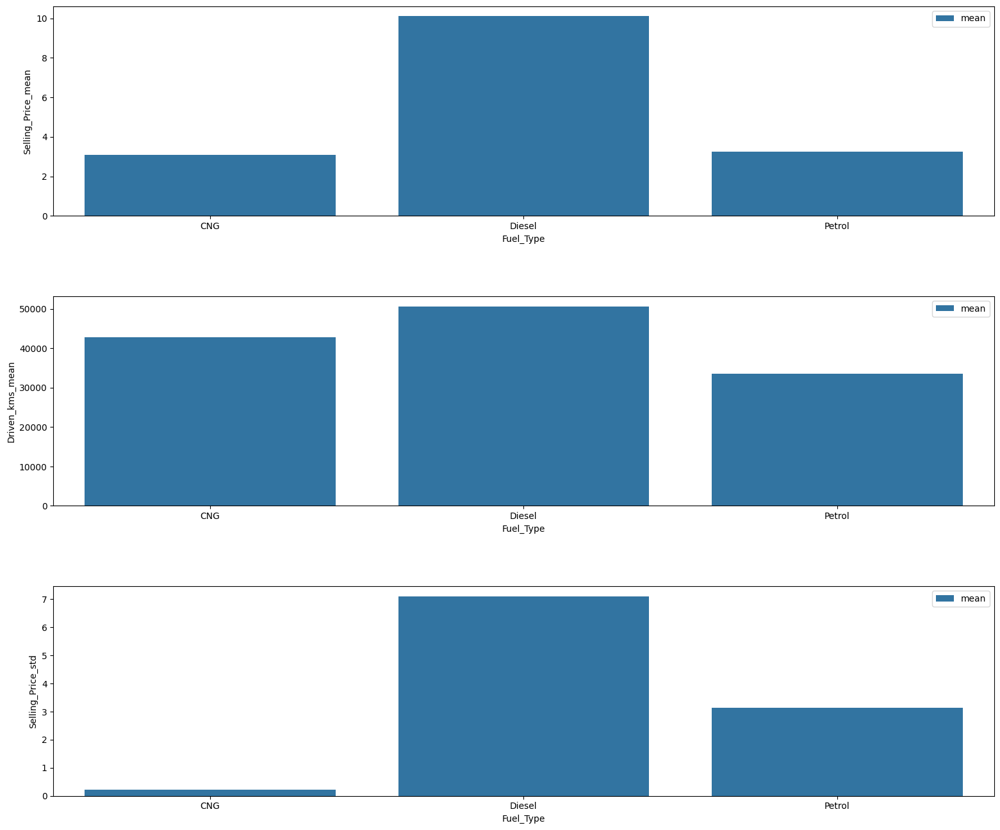

# Описание проекта
Проект посвящён анализу данных и решению задачи регрессии(предсказание цен на автомобили) 

[Датасет](https://www.kaggle.com/datasets/vijayaadithyanvg/car-price-predictionused-cars/data) 

## Установка и запуск

 Для MacOs и Linux вместо python использовать python3

**1. Клонировать репозиторий:**
```
git clone https://github.com/ViktorovGO/IIS_LR1.git
```

**2. Перейти в папку проекта:**
```
cd /IIS_LR1/
```

**3. Cоздать и активировать виртуальное окружение:**
```
python -m venv venv
```

Для Windows:
```
venv\Scripts\activate.bat
```

Для MacOs/Linux:
```
source venv/bin/activate
```

**4. Установить зависимости из файла requirements.txt:**
- Обновить пакетный менеджер pip
```
python -m pip install --upgrade pip
```

- Установить зависимости
```
pip install -r requirements.txt
```
**5. Создать папку data и поместить в неё датасет**
```
mkdir data
```
# Исследование данных

### Очистка данных 
- Приведены к категориальному типу: Car_Name, Year, Fuel_Type, Selling_type, Transmission, уменьшение веса выборки удалось добиться путём приведения Selling_Price и Present_Price к float16, Driven_kms к int32, Owner к int8
- Обнаружено 3 дупликата, удалены два из них
- Удалось добиться уменьшения размера выборки в 2 раза, примерно до 10 Кбайт
- Создан новый категориальный признак - уровень пробега

### Анализ признаков для модели


-  Автомобили старых лет 2003-2007, хотя их и немного в основном продаются по более низким ценам, новые же автомобили 2014-2018 в основном продаются по высоким ценам


- Для автомобилей старых лет 2003-2007, наблюдаются высокие значения пробега, новые же машины(2014-2018) в большинстве своем имеют более низкие значения пробега
- Пробег автомобилей коррелирует с годом выпуска


- Машины с низким пробегом продаются за разные сумммы, вероятно всё это зависит от марки машины и её класса
- Машины же с высоким пробегом в большинстве продаются за одни и те же суммы


- Наблюдаем очевидную корреляцию между ценой продажи и ценой покупки
- Но, почему-то, цена продажи автомобиля не коррелирует с пробегом


- Первый график
  - Видно, что цена продажи растет с годом выпуска машины, чем дороже машина, тем она новее, что очевидно
- Второй график
  - Пробег автомобиля падает с годом его выпуска, что тоже логично
- Третий график
  - Дисперсия цены продажи увеличивается с годом выпуска автомобиля, то есть новые автомобили имеют больший разброс в цене



- Первый график
  - Машины с типом топлива "Diesel" самые дорогие, самые дешевые - с типом топлива "CNG"
- Второй график
  - Самый большой пробег у автомобилей с типом топлива "Diesel", самый маленький у автомобилей с типом топлива "Petrol"
- Третий график
  - Машины с типом топлива "Diesel" имают самый большой разброс в цене, самый низкий - с типом топлива "CNG"


- Средняя стоимость автомобиля растет с годом выпуска автомбобиля, также видно, что в выборке больше всего новых автомобилей 2012-2018 года выпуска - 
[График](eda/Sell_from_Year.html)

- В выборке большинство автомобилей имеют пробег до 40000 км и стоимость автомобиля почти не зависит от его пробега - [График](eda/Sell_from_driven_kms.html)


- Самые дорогие машины - без единого владельца, машины с хотя бы оним владельцем стоят значительно дешевле - [График](eda/Sell_from_owners.html)

## Запуск mlflow
**1. Перейти в с mlflow:**
```
cd .\mlflow\
```

**2. Выполнить скрипт**
```
source .\mlflow_run.sh
```

## Результаты исследования

#### Лучший результат следующая модель
#### Preprocessor: 
- StandardScaler для преобразования числовых признаков
- OrdinalEncoder для преобразования категориальных признаков
- QuantileTransformer преобразует числовые признаки, чтобы они распределялись равномерно или нормально — так данные меньше подвергаются влиянию выбросов.
- PolynomialFeatures(создает полином степени degree=2 из указанных признаков - ['Present_Price', 'Driven_kms']) в сочетании с StandardScaler
- SplineTransformer(Cоздаёт новую матрицу признаков, состоящую из сплайнов порядка degree=2)
  
#### RandomForestRegressor:
- максимальная глубина дерева = 7
- процент признаков, по которым ищется разбиение = 0.9
- число деревьев в «лесу» = 4 
#### Метрики:
mae
0.7278808348625818\
mape
0.19918716621903648\
mse
1.8334715436246005 
```
run_id = 5634505d3bec42a1b46c234e34c29cab
```

## Сервис предсказаний

#### Описание файлов в папке ml_service
- api_handler.py содержит в себе обработчик модели, методы для загрузки модели и предсказания
- Dockerfile содержит в себе всё необходимое для сборки изображения
- main.py содержит в себе основное веб-приложение
- requiremets.txt содержит необходимые пакеты для работы проекта
- scemas.py описывает схему объекта таблицы
  
#### Описание файлов в папке models
- get_model.py это скрипт для получения модели и записи её в файл формата pkl
- model.pkl содержит модель
  
### Команды для создания образа и запуска контейнера
Создание изображения 
~~~
docker build . --tag car_model:0
~~~
Запуск контейнера
~~~
docker run -p 8001:8000 -v "$(pwd)/../models:/models" car_model:0
~~~

### Проверка работоспособности сервера

~~~
curl -X 'POST' 'http://localhost:8001/api/prediction?car_id=1' -H 'accept: application/json' -H 'Content-Type: application/json' -d '{"Car_Name": "ciaz", "Year": 2017,"Present_Price": 9.851562,"Driven_kms": 6900,"Fuel_Type": "Petrol","Selling_type": "Dealer","Transmission": "Manual","Owner": 0,"mileage_level": "Low"}'
~~~
